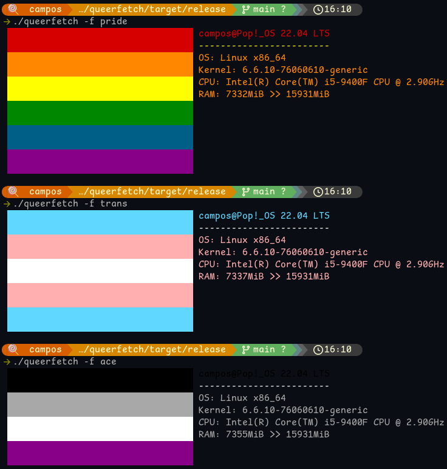
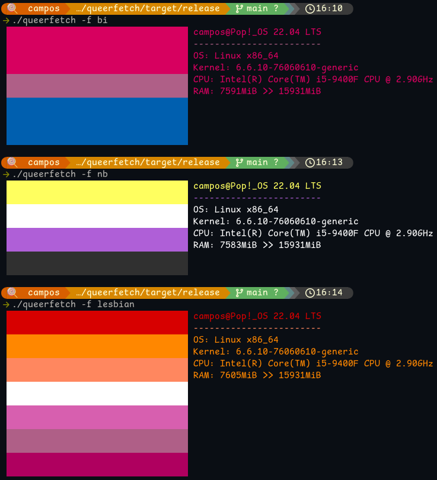

# QueerFetch

A command-line interface (CLI) written in Rust, similar to Neofetch, designed to display pride flags in the terminal

# Support

- [X] Linux
- [] Windows 
- [] Mac

# Usage

```sh
./queerfetch -f <FLAG NAME>
```

## Available flags (\<FLAG NAME\>)

```
pride OR lgbt
trans OR transgender
ace OR assexual
nb OR nonbinary
bi OR bisexual
pan OR pansexual
fluid OR genderfluid
queer OR genderqueer
```

# Installation

### Dependencies

You need rust to compile.

### Cloning and Compiling

```sh
git clone https://github.com/mochaeng/queerfetch.git
cd queerfetch
cargo build --release
```

### Usage

```sh
cd ./target/release/
./queerfetch -f pride
```

### Demo




